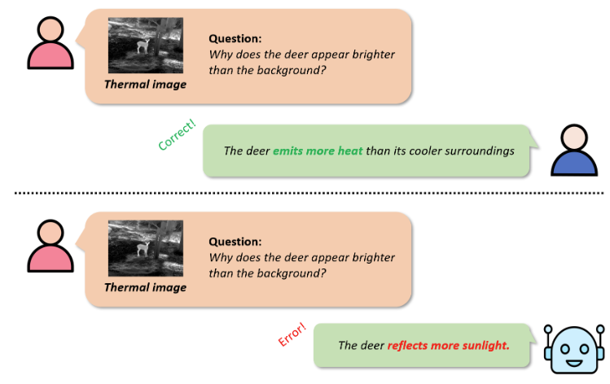
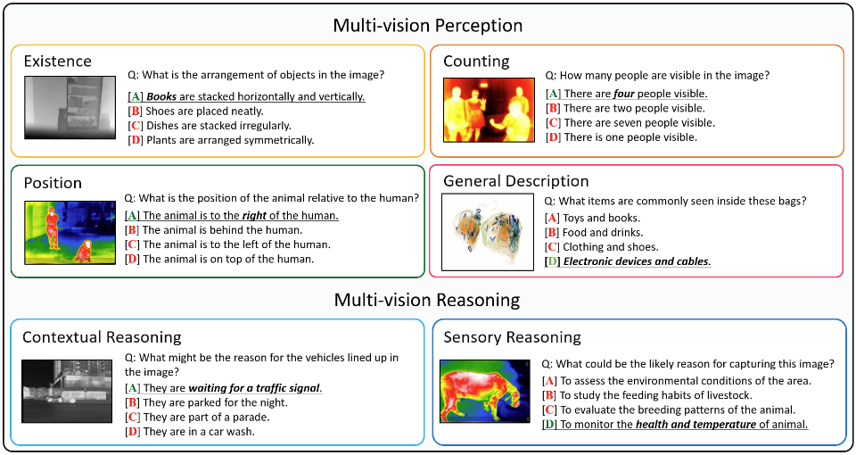
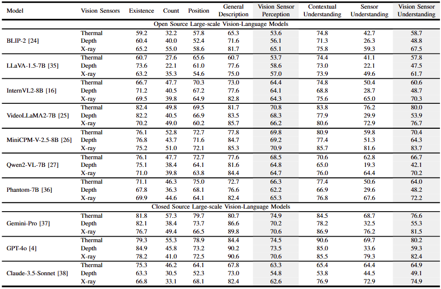
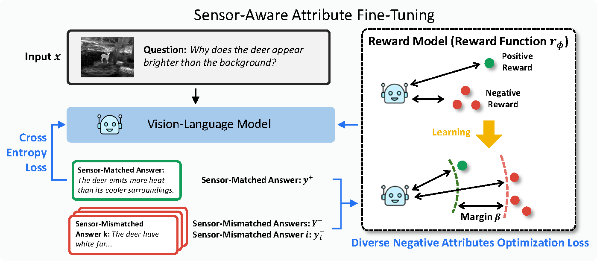
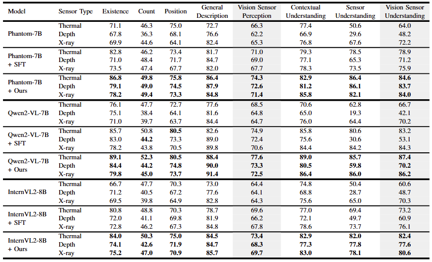

# VS-TDX Benchmark (Vision Sensor Perception and Understading Benchmark) 

[Benchmark Dataset](https://drive.google.com/file/d/1ES5epyF-XV0eI93vCc9w1UthTY9FYgVe/view?usp=sharing)

We present the **VS-TDX benchmark**, designed to evaluate Vision-Language Models (VLMs) on sensor-specific reasoning tasks. Alongside this, we propose the **Sensor-Aware Attribute Fine-Tuning** with **Diverse Negative Attributes (DNA) optimization**, enabling VLMs to perform deep reasoning across multi-vision sensor tasks by addressing the core information gap between images and sensor data. Experimental results demonstrate that DNA optimization significantly enhances the reasoning capabilities of VLMs in multi-vision sensor scenarios.

This project for a benchmark dataset and simple code examples for **VS-TDX benchmark**.

# 💡 Introduction

<p align="center">
  
</p>

Many Large-scale Vision-Language Models(LVLMs) have basic knowledge of various sensors such as thermal, depth, and X-ray, **but they process multi-vision sensor images without deep understanding of sensor information, disregarding each sensor’s unique physical properties.** This limitation restricts their capacity to interpret and respond to complex questions requiring multi-vision sensor reasoning. Therefore, we have created a benchmark, assessing VLMs on their capacity for sensor-specific reasoning.

# VS-TDX
<p align="center">
  
</p>

The benchmark dataset consists of **three types of sensors(Thermal, Depth, X-ray) and six types of questions(Existence, Count, Position, Scene Description, Contextual Understanding, Sensor Understanding).** Examples of each are shown in the image above. It consists of approximately 10k questions and answers, with the questions broadly categorized into **Multi-vision Perception** and **Multi-vision Understanding**.

# 🏆 VS-TDX Leaderboard

<p align="center">
  
</p>

# Our Method

We hypothesize that it primarily arises because VLMs are predominantly trained on RGB images. Making it difficult to effectively align each multi-vision sensor's unique physical properties with perceptual information. In other words, VLMs tend to make superficial judgments based on prior visible information derived from RGB image data.

There is two main issues for fine-tuning VLMs.

1. It is challenging to obtain diverse dataset for each sensor, resulting in limited instruction tuning datasets for each sensor.
2. VLMs often misinterpret multi-vision sensor data due to an over-reliance on RGB-bounded reasoning.

So, We focused on the incorrect answers. Incorrect answers can be generated not just as a single instance but in multiple variations. Through these incorrect answers, RGB-bounded reasoning can be suppressed.

<p align="center">
  
</p>

Through these methods, we were able to achieve sufficient fine-tuning with 200 images for each sensor. ([train dataset](https://drive.google.com/file/d/1z0kzT9iVRGqWNF6Q9X_Zajya2PS-iUbh/view?usp=drive_link))

<p align="center">
  
</p>

#  How to Evaluation?

We upload Benchmark Dataset on [Google Drive](https://drive.google.com/file/d/1ES5epyF-XV0eI93vCc9w1UthTY9FYgVe/view?usp=sharing). Please place it inside the './dataset' folder.

We have provided two example codes for evaluation: Open Model([**test.py**](https://github.com/top-yun/VS-TDX/blob/master/test.py)) and Closed Model([**test_closed_models.py**](https://github.com/top-yun/VS-TDX/blob/master/test_closed_models.py)). You can easily run them as shown below.

If you have 4 GPUs and want to run the experiment with llava-1.5-7b, you can do the following:
```bash
accelerate launch --config_file utils/ddp_accel_fp16.yaml \
--num_processes=4 \
test.py \
--batch_size 1 \
--model llava \
```

When running the closed model, make sure to insert your API KEY into the [**config.py**](https://github.com/top-yun/VS-TDX/blob/master/config.py) file.
If you have 1 GPU and want to run the experiment with gpt-4o, you can do the following:
```bash
accelerate launch --config_file utils/ddp_accel_fp16.yaml \
--num_processes=$n_gpu \
test_closed_models.py \
--batch_size 8 \
--model gpt \
--multiprocess True \
```

## Tips
The evaluation method we've implemented simply checks whether 'A', 'B', 'C', 'D', 'yes', or 'no' appears at the beginning of the sentence.
So, if the model you're evaluating provides unexpected answers (e.g., "'B'ased on ..." or "'C'onsidering ..."), you can resolve this by adding "Do not include any additional text." at the end of the prompt.
